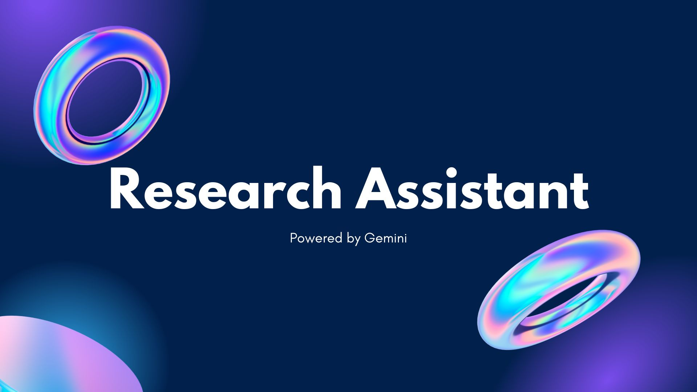

# ResearchAssistant

---

---

# **Project Research Assistant**  

## **Overview**  

Reading research papers, technical articles, or documentation shouldn’t feel like a scavenger hunt. **Project Research Assistant** is a browser extension that brings **instant explanations, contextual insights, and expert-level understanding—without ever leaving the page.**  

## **Features**  

- **Instant Explanations** – Highlight any text, and our AI will break it down for you in real time.  
- **Context-Aware Insights** – Get explanations that **consider surrounding content**, not just isolated definitions.  
- **Difficulty Control** – Choose how in-depth you want your answers, from **concise** to **expert-level breakdowns**.  
- **Seamless Integration** – Works on any webpage, research paper, or technical document **without breaking your flow**.  
- **Future Enhancements** – We’re working on **AI-powered image & graph analysis** to explain visuals in research papers.  

---

## **Installation**  

1. Clone this repository:  
   ```
   git clone https://github.com/your-repo/project-research-assistant.git
   ```
2. Open **Google Chrome** and navigate to:  
   ```
   chrome://extensions
   ```
3. Enable **Developer Mode** (toggle in the top right).  
4. Click **"Load unpacked"**, select the project folder, and load the extension.  

---

## **How to Use**  

1. **Enable the Extension**  
   - Toggle the extension on/off in the popup menu.  

2. **Highlight & Get Explanations**  
   - Select a word or phrase, and a **floating icon** will appear.  
   - Click the icon to get an AI-generated explanation.  

3. **Customize Explanation Depth**  
   - Use the **preset control** in the popup to choose:  
     - **Concise** (Short summary)  
     - **Normal** (Balanced explanation)  
     - **Detailed** (In-depth breakdown)  

4. **Enable Context Awareness**  
   - Click the **context button** in the popup to send the **entire page content** to AI for **more relevant responses**.  

---

## **Built With**  

- **HTML, CSS, JavaScript**  
- **Google Generative AI (Gemini 1.5-Flash)**  
- **Chrome Extension APIs**  
- **Chrome Storage API**  
- **Google Fonts (Google Sans, Open Sans)**  

---

## **How It Works**  

- **Text Selection Listener** – Detects highlighted text and triggers the floating icon.  
- **Popup UI & Settings** – Lets users enable/disable the extension, adjust difficulty, and send page context.  
- **Real-Time AI Responses** – Queries **Google Gemini AI** via a persistent chat session for contextual understanding.  
- **Smart Caching** – Reduces redundant API calls to optimize performance.  

---

## **Future Plans**  

- **Graph & Image Understanding** – AI-powered analysis of **charts, equations, and technical diagrams**.  
- **Multi-Source Context Awareness** – Expanding knowledge by pulling related articles and sources.  
- **Offline Functionality** – Allowing explanations even without an internet connection.  

---

## **Contributing**  

Want to improve the project? Fork the repo, make changes, and submit a pull request!  

---

## **License**  

MIT License – Use freely, modify, and share.  

---
